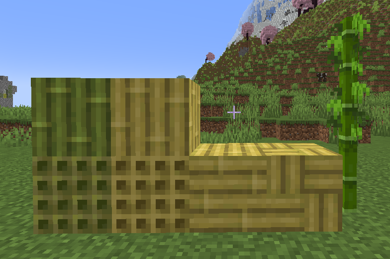
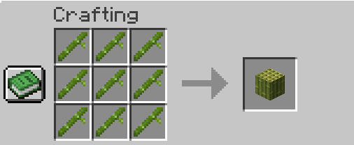
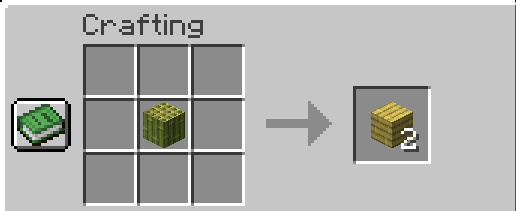
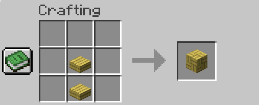
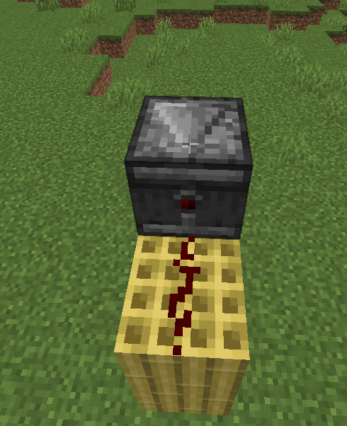
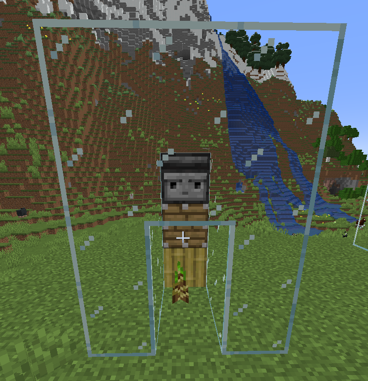
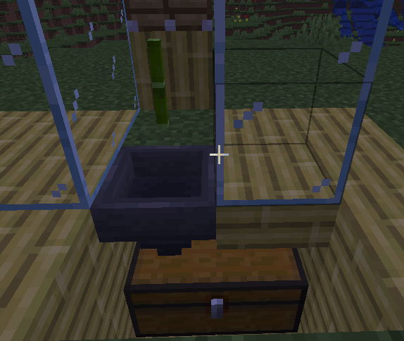
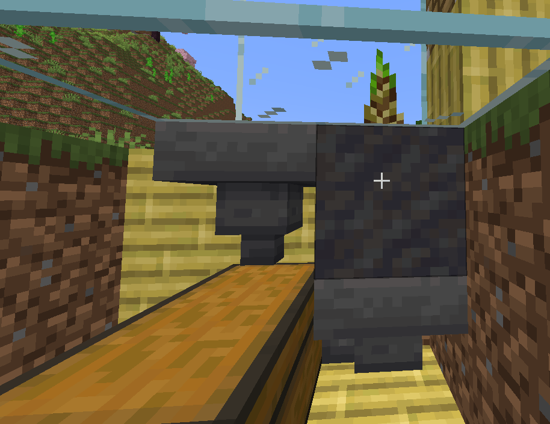
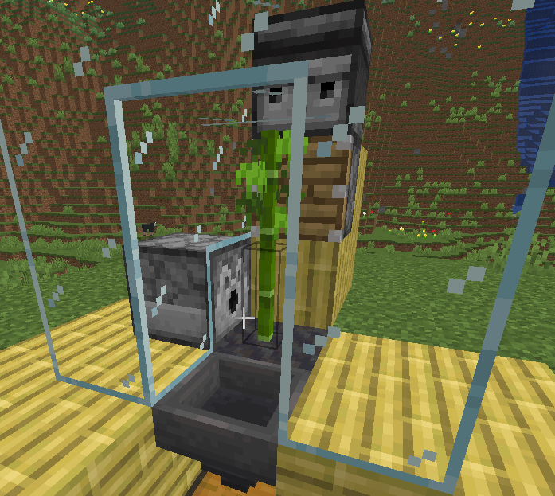
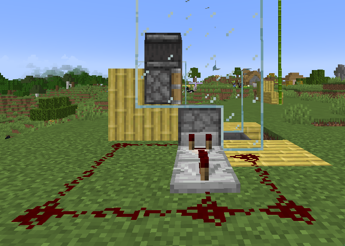

## Minecraft 1.20 Bamboo Farm

Minecraft 1.20 introduced new craftable bamboo blocks. This includes the Block of Bamboo, Block of Stripped Bamboo, Bamboo Planks, and Bamboo Mosaic. 

### Crafting Bamboo Blocks: 

You can craft bamboo blocks with nine bamboo. However, unlike most wood you only get 2 bamboo planks for every block. This means if you want to use bamboo to craft sticks, it is better to use two bamboo rather than two bamboo planks. 

While bamboo grows relatively fast and tall, it can be annoying to have to farm so much bamboo by hand. As such we'll go through a few different bamboo farms that will allow you to automate your bamboo gathering process :) 

#### The compact bonemeal farm 

This farm requires the following materials

- 1 bamboo 
- 1 piston
- 1 observer 
- 1 redstone 
- some building blocks of your choice (preferably glass)
- 2 hoppers
- 2 chests 

##### Step 1 Placing the main blocks down 

Place your bamboo down on the ground and a building block directly behind it. Next we're going to place the piston and observer. Make sure each of them are facing towards the bamboo. On top of the building block place the piston and on top of the piston place the observer. 

#### Step 2 Adding basic redstone for observer 

Now you need to go directly behind the piston. Place a building block behind it and then a piece of redstone directly on it. 
If you want to modify this into a sugarcane farm, place water underneath the building block. 

#### Step 3 Place the building blocks (optional)

Now we can place our building blocks. Go to the front of the bamboo and place your blocks to the right and left of the bamboo 3 high. Now place three blocks horizontally on top to prevent blocks getting stuck on top. You can extend this out by 1 block and place an additional block in the middle.

Now when the bamboo grows 3 high, the observer will detect the bamboo and cause the piston to activate. We can expand upon this farm in two ways: 

1) Add a dispenser to dispense bone meal on the bamboo
2) Expand and connect the machines

Before either of that, we'll add in the collection system. 

#### Step 4 Adding a collection system (optional)

In front of the bamboo place a hopper. Have this hopper feed into a chest. From there you can expand upon the storage as you like. Now one of the issues we're left with is what about the bamboo that doesn't fall onto the hopper and instead directly falls onto the bamboo that's growing? 

If we put a hopper directly underneath the dirt block, we won't be able to get the bamboo. 

We can fix this in two ways:

1) Change the block that the bamboo is growing on to something that hoppers can collect from under
2) Use a hopper minecart system

Since this farm isn't yet large, a hopper minecart system isn't really necessary. 

Bamboo can grow on a variety of blocks. Of them, hoppers can directly pull items from underneath mud. As such, if we replace the dirt with mud we'll get most of the bamboo. Furthermore, all you need to create mud in 1.20 is right click a dirt block with a water bottle. 

#### Step 5 Improving the collection system better (Optional)

Replace the dirt block with mud. Underneath place a hopper that feeds into the chest. Now items that fall onto the mud will get placed directly into the chest.

#### Step 6 Adding a bonemeal dispenser (optional)
Now that we have a collection system, the basic bamboo farm is mostly complete. If you want to leave it standalone you can however this farm will be slow. To speed things up I suggest extending this design or adding in a bonemeal component. 

For the bonemeal component, you'll need the following materials: 

- 1 dispenser 
- 1 comparator
- 1 repeater
- 9 redstone 
- as much bonemeal as you want 

Place a dispenser to either the right or left side of the bamboo. 

Behind the dispenser, place a comparator and repeater such that they are facing away from the dispenser. Add the redstone as seen in the image. Fill the dispenser with as much bonemeal as you want

If you're near your farm and like to compost seeds and the like, you can add in an automatic composter with the following modification: 

#### Step 7 Adding an automatic composter (Optional)

Break the block directly above the dispenser and replace it with a hopper feeding into it. Outside, have a hopper feed into the hopper you just placed. Above that place a composter and another hopper above it. At the very top place a chest. There will be 1 or 2 bamboo that get lost using this method, but this way you don't need to bonemeal by hand. Additionally if you want a chest there instead to hold extra bonemeal, you can replace the composter with a chest. 

#### Notes: 
- If the bonemeal dispenser is causing items to get stuck at the top, you can also increase the height of the roof by 1 block. 
- When increasing the size of the farm, you can replace the hoppers with a hopper minecart solution to save on iron or use a water stream to move items to a single hopper. 